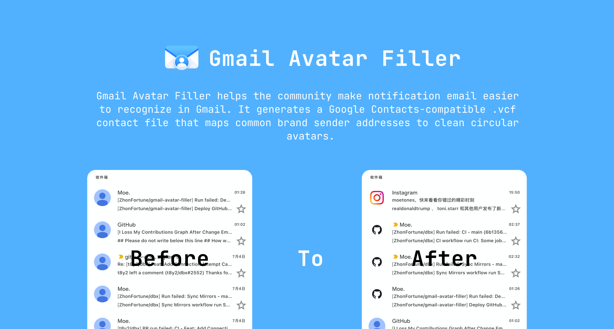

# Gmail Avatar Filler



[中文文档](README_ZHCN.md)

Gmail Avatar Filler helps the community make notification email easier to recognize in Gmail. It generates a Google Contacts-compatible `.vcf` contact file that maps common brand sender addresses to clean circular avatars.

<br>

## Project Goal

Many product, billing, security, and support emails show only the default avatar in Gmail. After importing the generated contact file, these emails gain consistent brand identity and become easier to scan in the inbox.

The project is maintained as open data:

- Brand sender metadata lives in `data/brands.json`.
- Logos come from open SVG logo repositories.
- Releases provide a ready-to-import `google-contacts-avatar.vcf` file.

<br>

## Usage

1. Open the latest GitHub Release.
2. Download `google-contacts-avatar.vcf`.
3. Import the file into Google Contacts.
4. Refresh Gmail after contacts finish syncing.

<br>

## Logo Sources

Icons are resolved in this order:

1. `pheralb/svgl` [https://github.com/pheralb/svgl](https://github.com/pheralb/svgl)
2. `VectorLogoZone/vectorlogozone` [https://github.com/VectorLogoZone/vectorlogozone](https://github.com/VectorLogoZone/vectorlogozone)
3. `gilbarbara/logos` [https://github.com/gilbarbara/logos](https://github.com/gilbarbara/logos)

If no matching logo is found, the build generates a simple initials avatar.

<br>

## Local Development

Requirements:

- Node.js 22 or newer.

Commands:

```bash
npm install
npm run build
npm run build:vcf
```

The site is written to `dist/`. The generated contact file is written to `dist/google-contacts-avatar.vcf`.

<br>

## Contributing

The community can contribute:

- Missing brands and sender addresses.
- Corrections for outdated domains or sender patterns.
- Better icon matching when a more suitable upstream logo exists.
- Accessibility, performance, or documentation fixes.

Before editing brand data, read the [Contribution Guide](CONTRIBUTION.md).

<br>

## License

Code is released under the MIT License. Brand names, logos, and trademarks remain the property of their respective owners. Logos are used only to help users identify email sources.
